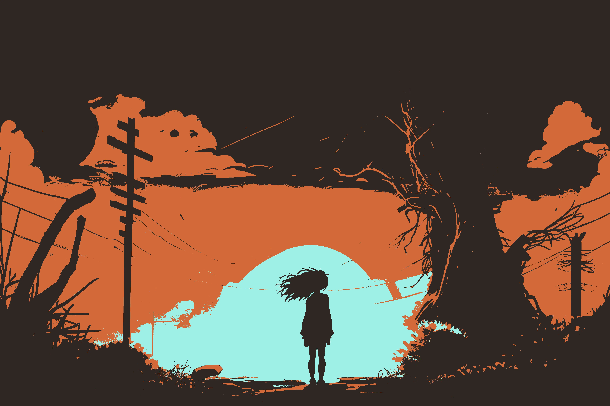

# A Post

# H1 {#header1}

## H2 {#header2}

### H3 {#header3}

#### H4 {#header4}

##### H5 {#header5}

###### H6 {#header6}

Emojis in this text will be replaced: :dog: :+1: :smile:



```kotlin
print("hello world from kotlin");

```

```java
class Main {
    public static void main(String[] args) {
        System.out.println("hello world");
    }
}
```

```
no lang code 123
```

Est in et et deleniti molestias autem ullam. Molestias rerum rem animi voluptatem quisquam. Quisquam eveniet ipsum sit
voluptas eum corrupti tempore praesentium autem odio ab. Saepe aut autem quia eos qui et. `inline code` Sint minus
repellendus quis
consequatur non error in ipsa aliquam et animi dolorem. Accusantium cumque qui tempore aut consequatur voluptatem
voluptatem voluptas facere. Qui occaecati sit qui excepturi cupiditate. Facilis consequatur quibusdam sit aut eaque
voluptas voluptas necessitatibus nemo amet dicta dolor. Totam maxime molestias aut placeat autem modi et magni sed
mollitia quis tempora corporis.
[^1]: My reference.


# GFM

## Autolink literals

www.example.com, https://example.com, and contact@example.com.

## Strikethrough

~one~ or ~~two~~ tildes.

## Table

| a   | b   |   c |  d  |
| --- | :-- | --: | :-: |

## Tasklist

- [ ] to do
- [x] done

## Alters

:::note{#header1 type=alert}
this is a note
:::
